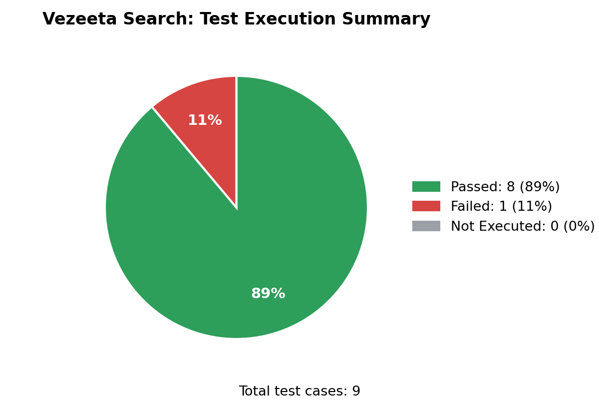

# Vezeeta: Test Cases

Test scenarios and test cases for the doctor search feature, written manually.

**Covers:**
- Selecting a specialty, city, and area
- Searching by doctor name
- Search button behavior
- Switching between the Telehealth and Book a Doctor tabs
- Invalid searches (unrelated terms)
- ## Defect found
**BUG-001:** Searching the "or search by name" field with an unrelated term (a cooking recipe) shows doctors from different specialties instead of a "no results" message. Searching a product name shows the expected message, so the behavior is inconsistent.
-Severity: Low.
## Test Execution Summary

**Tools:** Excel
